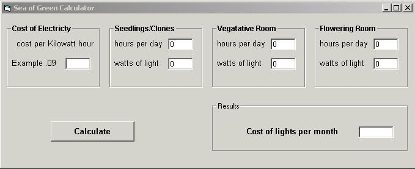



## Sea of Green Calculator2

### Description

Calculates the montly cost of a grow room depending on how many lights there are and the wattage of the light
 
### More Info
 

             |
---                |---
**Submitted On**   |2003-10-05 18:43:16
**By**             |[James Bank](https://github.com/Planet-Source-Code/PSCIndex/blob/master/ByAuthor/james-bank.md)
**Level**          |Beginner
**User Rating**    |5.0 (10 globes from 2 users)
**Compatibility**  |VB 6\.0
**Category**       |[Miscellaneous](https://github.com/Planet-Source-Code/PSCIndex/blob/master/ByCategory/miscellaneous__1-1.md)
**World**          |[Visual Basic](https://github.com/Planet-Source-Code/PSCIndex/blob/master/ByWorld/visual-basic.md)
**Archive File**   |[Sea\_of\_Gre1654821062003\.zip](https://github.com/Planet-Source-Code/james-bank-sea-of-green-calculator2__1-49054/archive/master.zip)

